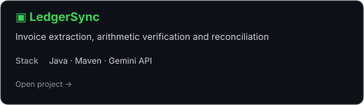
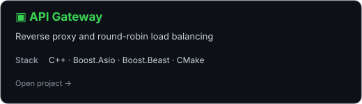
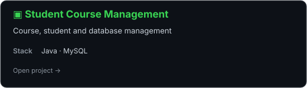
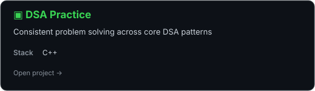

<div align="center">

<a href="https://github.com/1solanki1">
  
</a>

<br>

<font color="#39D353"><b>Computer Science & Business Systems Student · Developer · Problem Solver</b></font>

Building practical software, strengthening DSA fundamentals, and learning backend engineering by shipping real projects.

<br><br>

<a href="https://www.linkedin.com/in/akshay-solanki-26a0a51b6/"></a>
<a href="https://leetcode.com/u/1solanki1/"></a>
<a href="https://github.com/1solanki1"></a>
<a href="https://www.instagram.com/1solanki1/"></a>

<br><br>


</div>

---

## <font color="#39D353">`~/` whoami</font>

```console
$ cat about.txt
```

Hi, I'm **Akshay Solanki** — a B.Tech **Computer Science & Business Systems** student at NIET, Greater Noida.

I enjoy turning concepts into working software: solving DSA problems, building Java/C++ projects, working with SQL databases, and learning how reliable backend systems are designed.

- 🎓 Computer Science & Business Systems student
- 💻 Focused on **C++, DSA, Java, SQL and backend fundamentals**
- 🔧 Interested in APIs, databases, system design and practical software engineering
- 🚀 I prefer building and shipping over only following tutorials
- 🎯 Preparing for software development opportunities

---

<div align="center">

## <font color="#39D353">`~/` toolbox</font>


</div>

---

<div align="center">

## <font color="#39D353">`~/` skill radar</font>

<picture>
  <source media="(prefers-color-scheme: dark)" srcset="assets/skills-dark.svg?v=5">
  <source media="(prefers-color-scheme: light)" srcset="assets/skills-light.svg?v=5">
  
</picture>

<sub>Self-rated focus areas — not benchmark scores.</sub>

</div>

---

## <font color="#39D353">`~/` current build log</font>

```text
[█████████████████░░░] DSA / Problem Solving
[█████████████████░░░] C++ / Implementation
[███████████████░░░░░] Java / Backend Fundamentals
[███████████████░░░░░] SQL / DBMS
[██████████░░░░░░░░░░] System Design
```

## <font color="#39D353">2026 goals</font>

- [ ] Push DSA problem solving consistently
- [ ] Strengthen System Design fundamentals
- [ ] Build stronger backend projects
- [ ] Improve DBMS, OS, CN and OOP fundamentals
- [ ] Land a software development role

---

<div align="center">

## <font color="#39D353">`~/` coding stats</font>

<a href="https://leetcode.com/u/1solanki1/">
  
</a>

<br><br>

<a href="https://github.com/1solanki1">
  
</a>
<a href="https://github.com/1solanki1">
  
</a>

</div>

---

## <font color="#39D353">`~/` philosophy.cpp</font>

```cpp
if (code.isLikeHumor()) {
    if (you.haveToExplainIt()) {
        cout << "It's bad.";
    } else {
        cout << "It's good.";
    }
}
```

> **"Code is like humor. When you have to explain it, it's bad."**

---

<div align="center">

## <font color="#39D353">`~/` contribution graph</font>

<picture>
  <source media="(prefers-color-scheme: dark)" srcset="https://raw.githubusercontent.com/1solanki1/1solanki1/output/pacman-contribution-graph-dark.svg">
  <source media="(prefers-color-scheme: light)" srcset="https://raw.githubusercontent.com/1solanki1/1solanki1/output/pacman-contribution-graph.svg">
  
</picture>

</div>

---

<div align="center">

## <font color="#39D353">`~/` selected work</font>

<table>
<tr>
<td width="50%" valign="top">
<a href="https://github.com/1solanki1/ledgersync-ai-reconciliation"></a>
</td>
<td width="50%" valign="top">
<a href="https://github.com/1solanki1/api-gateway-reverse-proxy-load-balancer"></a>
</td>
</tr>
<tr>
<td width="50%" valign="top">
<a href="https://github.com/1solanki1/student-course-sql-java"></a>
</td>
<td width="50%" valign="top">
<a href="https://github.com/1solanki1/neetcode-submissions"></a>
</td>
</tr>
</table>

</div>

---

<div align="center">

<font color="#39D353">`01000001 01101011 01110011 01101000 01100001 01111001`</font>

### <font color="#39D353">Always learning. Always building. 🚀</font>

</div>
